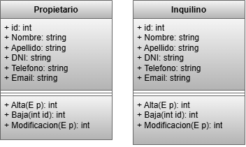

# InmobiliariaSAD
.net practica

> El sistema trata de la informatización de la gestión de alquileres
temporarios de propiedades inmuebles que realiza una agencia
inmobiliaria.

---

## 👥 Integrantes del Grupo

* **Leandro Amaya** - *emanuelamaya200@gmail.com* - [@emanuelamaya200-source]
* **Fabian D'Agata** - *angelfabiandagata@gmail.com* - [@angelfabiandagata-ui]
* **Lucas Serrano** - *serranolucas1000@gmail.com* - [@lucasserrano7]

---

## 📐 Modelado de Datos

A continuación se presenta el esquema del modelo de datos correspondiente a la aplicación:

## Comandos

Instalar el conector sql desde la terminal: dotnet add package MySqlConnector
En (appsettings.json) agregar:

"ConnectionStrings": {
  "DefaultConnection": "Server=localhost;Database=InmobiliariaDb;User=root;Password=;"
}

Para inicializar: - dotnet run  

